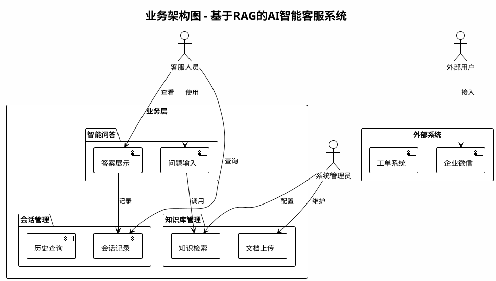
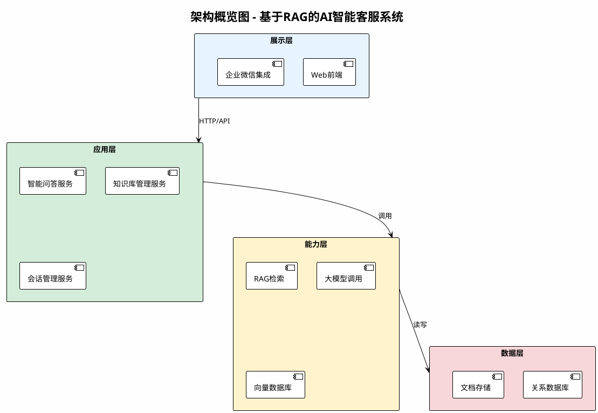
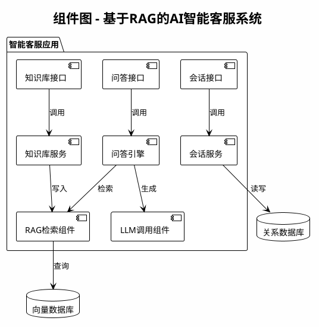
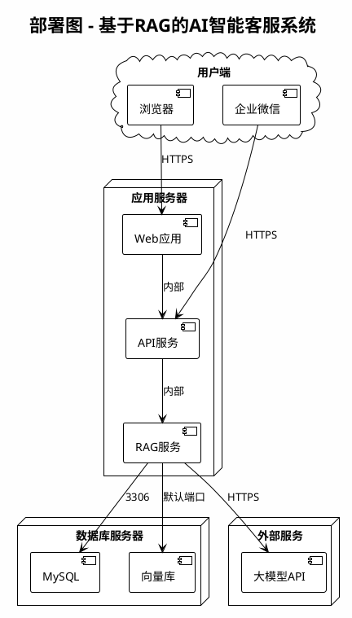

# 概要设计说明书结构参考

本文档描述默认输出的文档结构，参考「概要设计说明书模板样例」「基于RAG的AI智能客服项目交付样例（业务架构图+架构概览图+组件图+部署图）」及需求规格说明书。

---

## 一、引言

### 1.1 目的
说明本文档的编制目的及读者对象（如：开发人员、测试人员、项目经理）。

### 1.2 范围
说明本概要设计涵盖的系统范围，与需求规格说明书中的范围保持一致。

### 1.3 定义与缩写
列出文档中使用的术语、缩写及定义。

### 1.4 参考资料
列出需求规格说明书、相关法规、标准、上级文档等。

---

## 二、总体设计

### 2.1 设计目标
从需求规格说明书中提炼的设计目标（如：高可用、可扩展、易维护）。

### 2.2 设计原则
遵循的设计原则（如：模块化、松耦合、高内聚）。

### 2.3 技术选型
- 开发语言与框架
- 数据库与中间件
- 部署与运维技术

---

## 三、业务架构图

### 3.1 图说明
描述业务架构图展示的业务模块、角色、流程关系。

### 3.2 PlantUML 脚本示例（业务架构图）

---

## 四、架构概览图

### 4.1 图说明
描述系统分层结构、模块划分、主要技术组件。

### 4.2 PlantUML 脚本示例（架构概览图）

---

## 五、组件图

### 5.1 图说明
描述核心组件及其依赖、接口关系。

### 5.2 PlantUML 脚本示例（组件图）

### 5.3 组件说明表

| 组件名称 | 职责 | 依赖 |
|----------|------|------|
| 问答接口 | 接收用户问题，返回答案 | 问答引擎 |
| 知识库接口 | 文档上传、知识管理 | 知识库服务 |
| 会话接口 | 会话记录、历史查询 | 会话服务 |
| 问答引擎 | 编排 RAG 与 LLM，生成回答 | RAG、LLM |
| RAG检索组件 | 向量检索、上下文组装 | 向量数据库 |

---

## 六、部署图

### 6.1 图说明
描述部署节点、运行环境、网络拓扑。

### 6.2 PlantUML 脚本示例（部署图）

### 6.3 部署说明表

| 节点 | 组件 | 环境要求 | 说明 |
|------|------|----------|------|
| 应用服务器 | Web应用、API服务、RAG服务 | 4核8G+、Linux | 可容器化部署 |
| 数据库服务器 | MySQL、向量库 | 2核4G+ | 可云托管 |
| 外部服务 | 大模型API | 网络可达 | 按需配置 |

---

## 七、接口设计

### 7.1 主要接口列表

| 接口名称 | 方法 | 路径 | 说明 |
|----------|------|------|------|
| 智能问答 | POST | /api/qa/ask | 接收问题，返回答案 |
| 知识库上传 | POST | /api/kb/upload | 上传文档到知识库 |
| 会话查询 | GET | /api/session/list | 查询历史会话 |

### 7.2 接口详细说明（示例）

**智能问答接口**
- 请求：`{ "question": "string", "session_id": "string" }`
- 响应：`{ "answer": "string", "sources": [] }`

---

## 八、非功能性设计

### 8.1 性能设计
- 响应时间目标
- 并发处理策略
- 缓存策略

### 8.2 安全设计
- 认证与授权
- 数据加密
- 审计日志

### 8.3 可扩展性设计
- 水平扩展方案
- 模块解耦设计

---

## 文档输出建议

- 若输出为 Markdown，可使用上述结构直接生成，PlantUML 代码块便于复制到 [PlantUML 在线](https://www.plantuml.com/plantuml) 或本地工具渲染。
- 若用户提供自定义 Word 模板，按模板章节结构填充，保持业务架构图、架构概览图、组件图、部署图四类 PlantUML 脚本完整。
- 所有内容使用中文，避免错别字与乱码。
